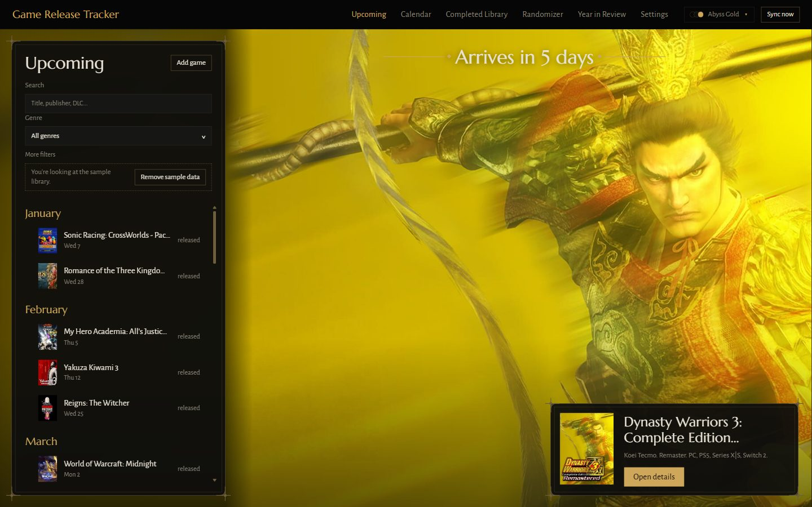
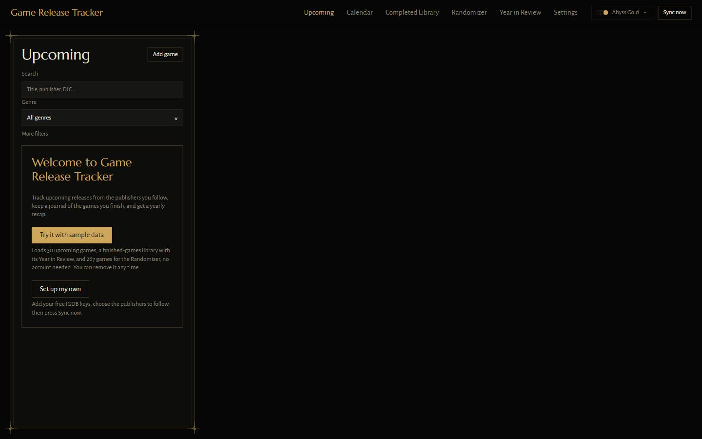
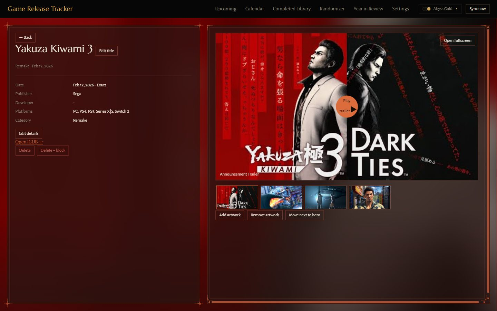
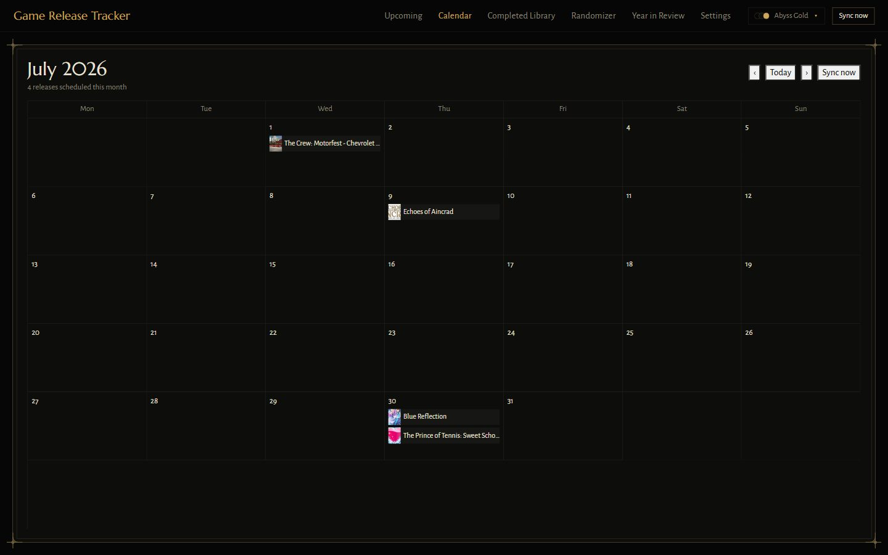
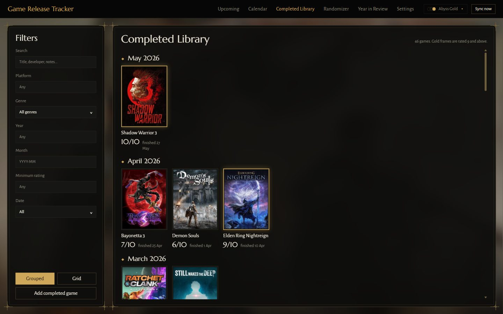
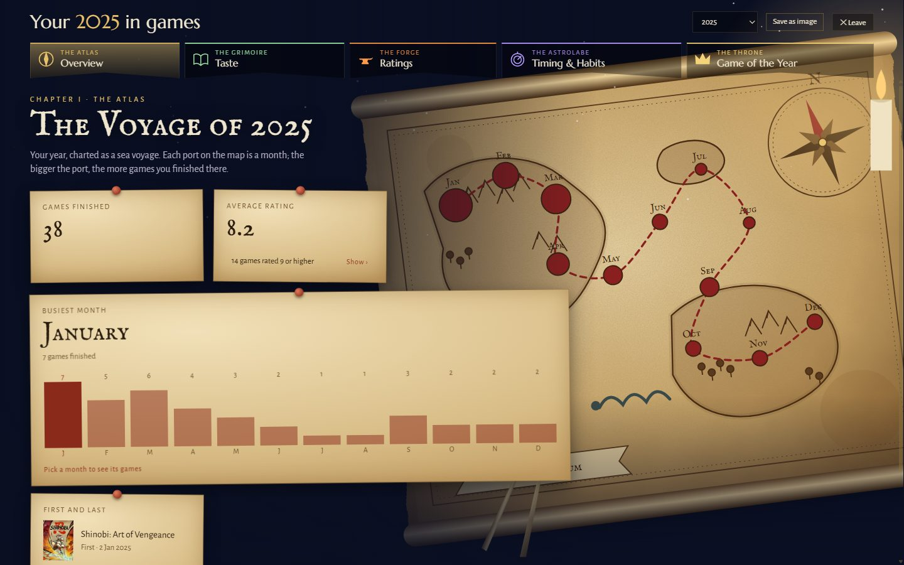
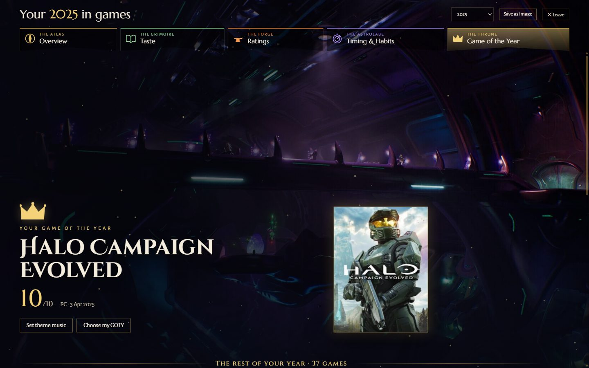
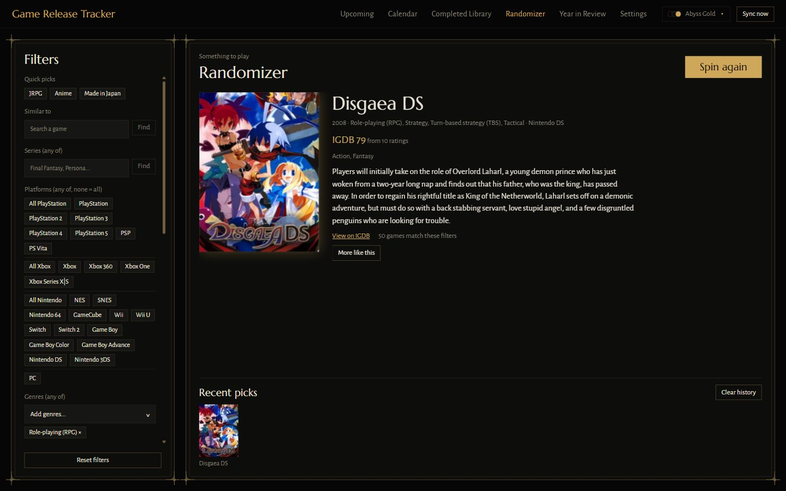
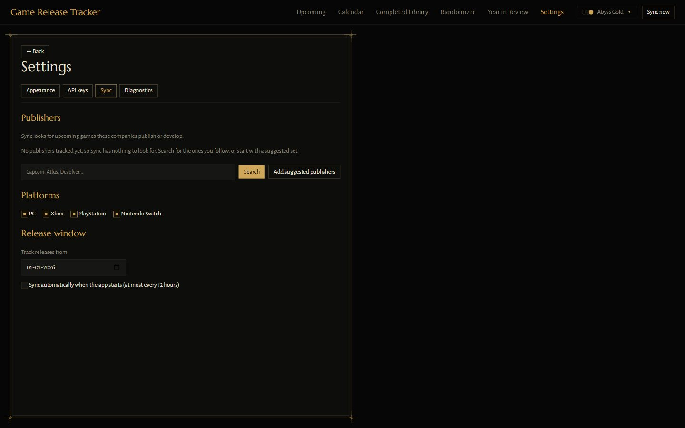

# Game Release Tracker

**A desktop app for people who play a lot of games.** It keeps track of the upcoming games from the publishers you follow, keeps a journal of the games you finish, picks something new to play when you can't decide, and turns your year of gaming into a visual recap.

Everything runs on your own computer. There is no account, no cloud and no tracking.



[](https://github.com/hachi23/game-release-tracker/actions/workflows/ci.yml)
&nbsp;Windows · MIT license · 530 automated tests

---

## Try it in two minutes

1. Download **`Game Release Tracker Setup.exe`** (installer) or the **`.zip`** (no install) from the [latest release](https://github.com/hachi23/game-release-tracker/releases/latest).
2. Open it. Windows may say *"Windows protected your PC"*, because the app isn't signed with a paid certificate. Click **More info**, then **Run anyway**.
3. On the welcome screen, click **Try it with sample data**.

That loads a sample library: 30 upcoming games, 46 finished games with a full Year in Review, and 267 games for the Randomizer. You can look around everything without signing up for anything. **Remove sample data** takes it out again.



---

## What it does

### Upcoming releases
A list of the games coming out from the publishers you follow, grouped by month, with a countdown to the next one. Search it, filter it by genre or platform, mark games as watched or hidden, or add a game by hand. Every game has a detail page with its artwork, screenshots and trailer.

| | |
|---|---|
|  |  |
| *A game's page, tinted in its cover's colours* | *The same releases on a calendar* |

### Completed Library
A journal of the games you've finished: when, on what, your rating and your notes. The app finds each game on IGDB (the Internet Game Database) and adds its cover, genres and details automatically.



### Year in Review
Your year of gaming told as a story in five chapters: how much you played, what you like, how you rate games, when you play, and your Game of the Year. It can be saved as an image to share. Every chapter is drawn as its own illustrated "realm".

| | |
|---|---|
|  |  |

### Randomizer
Can't decide what to play? The Randomizer picks a random released game from the whole IGDB catalogue, filtered by genre, theme, platform, rating or year, and avoids repeating recent picks.



### Your own setup
In **Settings** you choose which publishers to follow, which platforms you play on (PC, Xbox, PlayStation, Nintendo Switch) and how far back to track, pick one of twelve colour themes, and set a wallpaper.



---

## Using it with your own games

The sample library is there to look around. To track real releases:

1. Get free API keys from IGDB (it takes about five minutes with a Twitch account: [how to get IGDB keys](https://api-docs.igdb.com/#account-creation)).
2. In the app, open **Settings → API keys**, paste them in and click **Save settings**.
3. In **Settings → Sync**, search for the publishers you follow (or click **Add suggested publishers**) and choose your platforms.
4. Click **Sync now**.

The [User Guide](docs/USER_GUIDE.md) walks through every screen.

---

## Privacy

- **Everything stays on your computer.** Your library, notes and settings live in a local database in your user folder.
- **Your keys are encrypted** with Windows' own protection and are never shown again after you save them.
- **No accounts, analytics or crash reporting.** The app only contacts:
  - IGDB and Twitch, to look up games (only after you add keys);
  - IGDB's image server, for covers and artwork;
  - SteamGridDB, for extra artwork (only if you add its optional key);
  - YouTube's privacy-enhanced player, only when you press play on a trailer or on theme music.
- **Settings → Diagnostics → Delete all app data** removes everything the app stored.

---

## How it was built

The idea, the features and every product decision are mine: what the app should do, how each screen should feel, the Year in Review chapters, and the rules for what counts as an upcoming release. I wrote the specifications and plans, reviewed each change and tested the results.

Most of the code was written by AI coding assistants (Anthropic's Claude Code and OpenAI's Codex) working from those specifications. The commit history shows how the project grew, and [How it works](docs/HOW_IT_WORKS.md) explains the design and the decisions behind it in plain language.

---

## Documentation

| For | Read |
|---|---|
| Anyone using the app | [User Guide](docs/USER_GUIDE.md) |
| Anyone curious how it works, no coding needed | [How it works](docs/HOW_IT_WORKS.md) |
| What changed in each version | [Changelog](CHANGELOG.md) |
| Developers: a guided tour of the code | [Review Guide](docs/REVIEW_GUIDE.md) |
| Developers: where everything lives | [Codebase Map](docs/CODEBASE_MAP.md) |
| Developers: full technical reference | [Technical Documentation](docs/DOCUMENTATION.md) |
| The words the code uses, and the rules it keeps | [CONTEXT.md](CONTEXT.md) |

## Running from source

You need [Node.js](https://nodejs.org) 22.

```bash
npm install
npm test          # 530 automated tests
npm run build     # compile everything
npm run dist      # build the Windows installer and zip into dist/
```

No API keys are needed to install, test or build. Built with Electron, React, TypeScript, Fastify and SQLite.

## License

[MIT](LICENSE) © hachi23. Game data and images come from [IGDB](https://www.igdb.com) and [SteamGridDB](https://www.steamgriddb.com) and belong to their owners.
